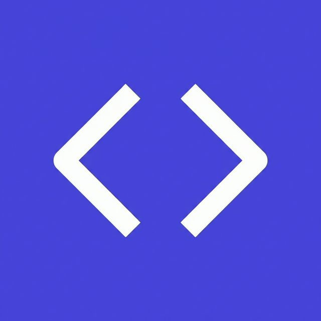
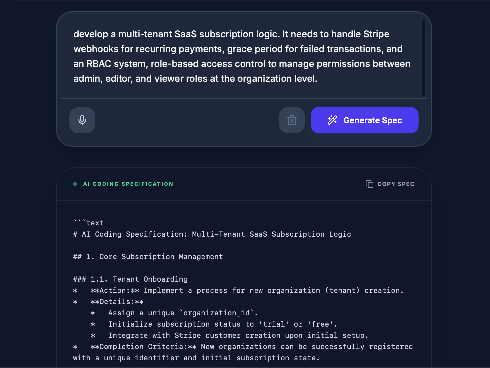
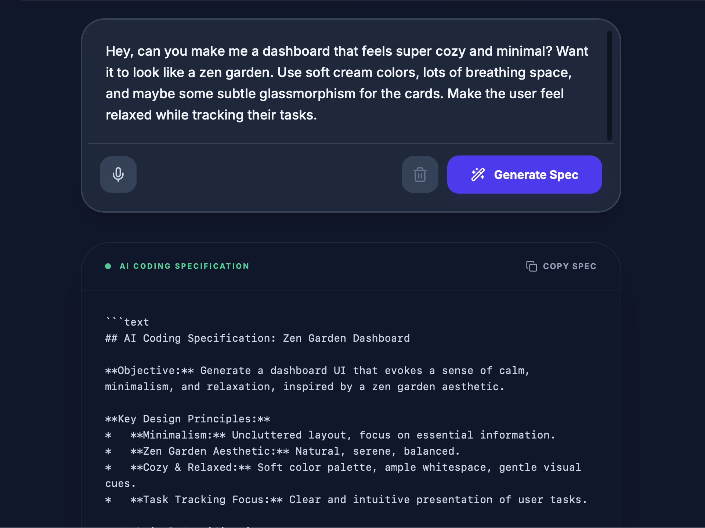
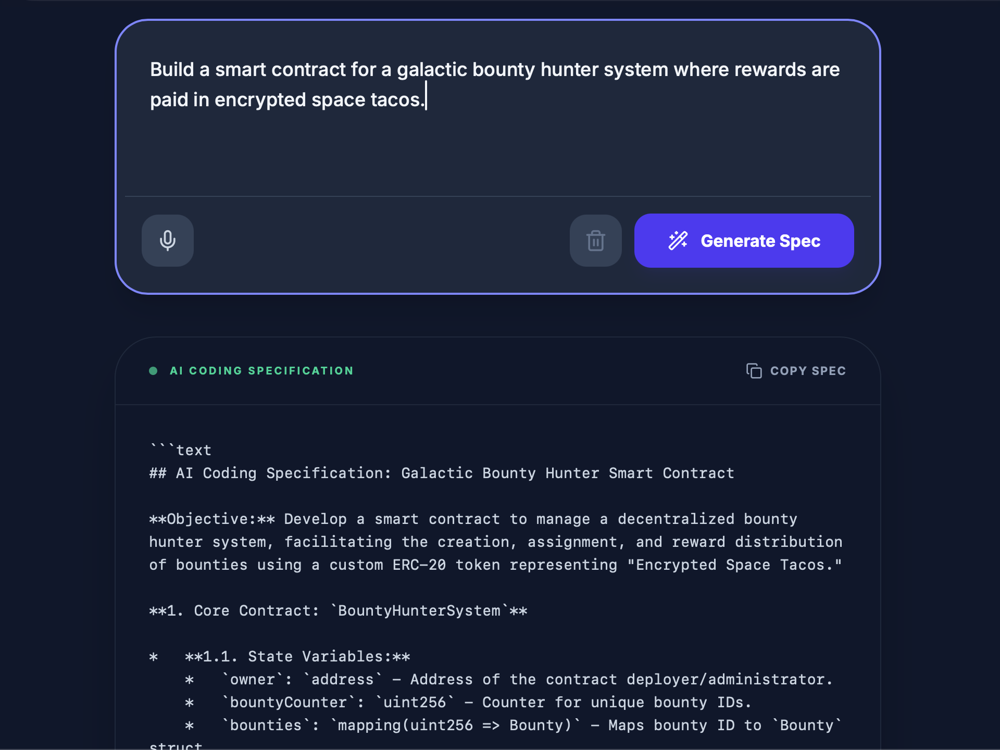

# Vibe Coding Translator

---
## **Stop AI Over-Engineering & Save Tokens. Translate natural language into structured, unambiguous prompts.**

> [!TIP]
> **[Try it Now: soluneai.com/vibe-coding-translator](https://soluneai.com/vibe-coding-translator/)**
> **Get 3 Free High-Precision Instructions automatically upon sign-in.**

---

### 🌈 High-Precision Demos
*Instructions below are 100% generated from a single vibe prompt.*

#### 1. SaaS Subscription Logic
*Complex business logic simplified into clear, executable instructions.*

#### 2. Zen Garden Dashboard
*Cozy, minimal UI requirements with precise component breakdowns.*

#### 3. Galactic Bounty Hunter
*Creative prompts translated into robust data structures for AI Agents.*

---

## ⚡ The Problem: "Development Constipation"
When you tell an AI to "make this look better" or "fix the layout," it often:
1.  **Guesses blindly**, leading to unintended side effects.
2.  **Over-engineers** simple components into complex spaghetti code.
3.  **Vanishes your quota**—Endless, unguided revisions can burn through your token budget in minutes.

`Vibe Coding Translator` is the precision engine designed to eliminate this ambiguity and **stop the token burn**.

## 🚀 How it Works
This tool acts as a **Communication Bridge**. It translates your messy thoughts into industrial-grade AI instructions with:
* **Scope Locking**: Ensures the AI only modifies what you intended, preventing expensive "logic drifts."
* **Surgical Precision**: Built-in coordinate offsets and specific UI logic.
* **Token Efficiency**: By providing a rigid "Ground Truth," you eliminate redundant model calls and "hallucination loops."
* **Zero Misunderstanding**: Formats requirements into a language that Agents (Claude Code, Cursor, Windsurf) cannot ignore.

## 📦 Part of The Vibe Stack
This project is a core component of [The Vibe Stack](https://github.com/solune-lab/the-vibe-stack) — a production-ready survival kit for frugal developers.

* **Brain**: [Vibe Coding Rules](https://github.com/solune-lab/the-vibe-stack#a-brain-vibe-coding-rules)
* **Nerve**: [Glue Code Puzzles](https://github.com/solune-lab/the-vibe-stack#b-nerve-glue-code-puzzles-quick-start)
* **Mouth**: **Vibe Coding Translator** (You are here)

## 🛠️ Usage
1.  Access the tool: [soluneai.com/vibe-coding-translator](https://soluneai.com/vibe-coding-translator/)
2.  Input your "Vibe" (e.g., *"Make the header more modern and fix the mobile padding"*).
3.  Get the **Agent-Ready Prompt** — a structured instruction optimized for AI Agents.
4.  Paste it into your Agent and **save your tokens** by getting it right the first time.

---

## 🤝 Contributing

Have a template or a logic improvement? PRs are always welcome! 

## 🌟 Support & Connect

If this workflow saved your tokens (and your sanity), please give this repository a 💫**Star**!

### 📢 Stay Updated
* **Twitter / X**: [@soluneai](https://x.com/soluneai)
* **Threads**: [@soluneai_com](https://www.threads.net/@soluneai_com)

---
*Built by a frugal developer, for frugal developers. Stay efficient.*
